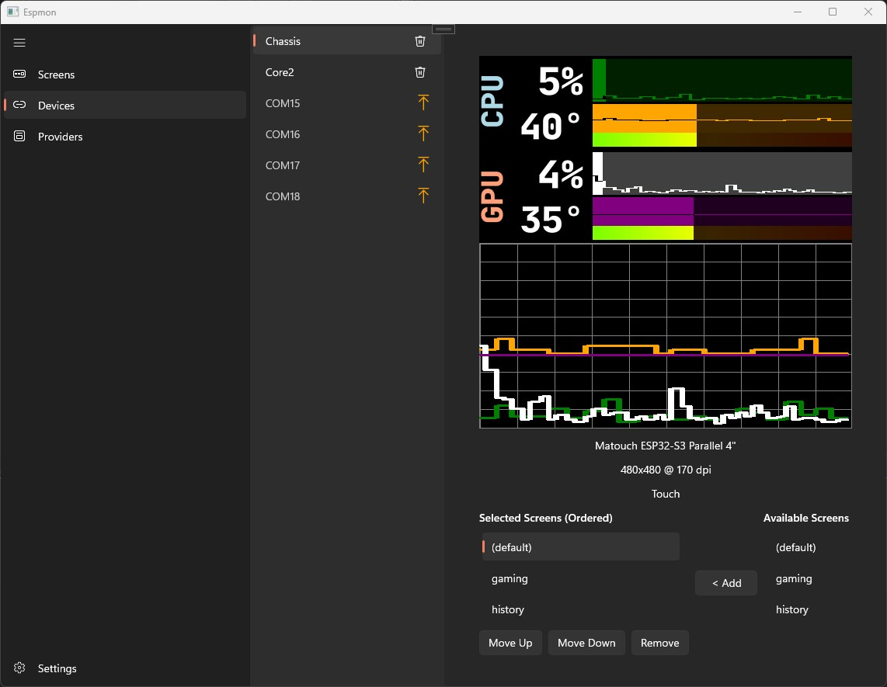
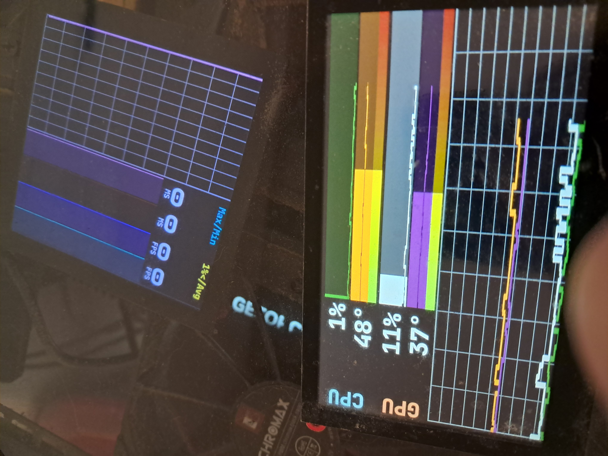

# Espmon 4

This is a fully programmable hardware monitor application that can display things like frame rates, and CPU temperatures (if CoreTemp is installed) or other hardware metrics on attached/supported ESP32s.

It currently supports windows 10/11 on the PC side. In terms of ESP32 kits, the following are supported:

- Makerfabs/Matouch ESP Parellel Display models in 3.5, 4 and 4.3 inch models
- Lilygo "TTGO" T1 Display v1.1 
- Cheap Yellow Display 2432S028
- M5 Stack Core2

It allows you to use a programmable query system to collect and transform data, even allowing you to create histories of arbitrary values over a particular time period, so you can for example keep tabs on the hottest your CPU has been over the past hour.

You can have 4 arbitrary values per screen, and the screens are divided into two categories of value. Each device can flip through available screens using a touch screen or attached button (assuming the kit has one or the other)

You can run as many attached ESP32s with independent screens as you like, and each one can have its own set of screens you can flip through by manipulating it as above.

The application allows you to flash the devices straight from the application.

The application also allows your dashboard to be persisted as a service so it's available as soon as windows boots and not dependent on a user running the application explicitly to start the monitoring.

To run, use Install.exe to extract to a folder. You can execute Espmon.exe from the extract location or have it create shortcuts

Note that installing [Core Temp](https://www.alcpu.com/CoreTemp/) is highly recommended so that this software can read your temperature information. It contains the necessary driver for Windows now that winring0 is no longer viable.

### ⚠️ Windows SmartScreen warning

When you run the installer, Windows may show "Windows protected your PC." This happens because the installer isn't code-signed yet, so it has no established reputation with Microsoft — not because it contains anything harmful. This is a fully open-source project; you can inspect or build the source yourself.
To proceed: click More info, then Run anyway.

(Optional) You can verify the download matches the official release by checking its SHA-256 hash against the value published on the [Releases page].

You can skip the installer entirely, unzip the files to the desired directory, and run Espmon.exe from there.

### To build:
- you need Visual Studio 2026 (C# and C++)
- you need a recent copy of python installed and in your path.
- You need the ESP-IDF 5.x Installed



### Premade Screens

Included in the root of this repository is a file called `espmon.screens.json`
This includes 3 screens for monitoring common items. 
It can be imported via the Open button in the Screens section.

# Hardware Monitor Query Language — Reference

A query is a small expression that selects some hardware sensors and (optionally) crunches
the numbers. This guide is for people *writing* queries, like the ones in a `.screen.json`
file.

---

## 1. The one thing to know first

**Every query produces a *list* of values, and every value carries a number plus a unit.**

A regex like `'^/.+/gpu/[0-9]+/temperature$'` might select four GPU temperature sensors, so
it evaluates to a list of four numbers. Functions like `avg(...)` or `max(...)` boil a list
down to a single number. Arithmetic (`+`, `-`, `*`, `/`) transforms each number in the list.

So most real queries follow the shape:

```
reduce( select )        e.g.  avg('^/.+/gpu/[0-9]+/load$')
```

---

## 2. Selecting sensors

There are two ways to point at sensors.

### Paths — pick one exact sensor

Start with `/` and write the full path. A path runs until the first space or `)`.

```
/coretemp/cpu/0/core/0/load
```

### Regex matches — pick a whole set

Wrap a regular expression in single quotes. It's matched against sensor paths, and every
sensor whose path matches comes back in the list. This is the workhorse for grabbing "all
cores" or "all GPUs."

```
'^/coretemp/cpu/[0-9]+/core/[0-9]+/load$'
```

Notes on the regex flavor:

- **Case-sensitive**, and `^` / `$` anchor the start and end of the whole path.
- To include a literal single quote inside the pattern, escape it as `\'`.
- Character classes work as usual: `[a-z]`, `[0-9]`, etc. (A `'` inside `[...]` is treated
  as a literal, not the end of the pattern.)
- Capturing groups aren't needed here — you're matching, not extracting — so don't worry
  about `(...)` behavior.

---

## 3. Numbers

Plain numeric literals, with optional sign, decimals, and exponent:

```
100      3.14      -5      1e3      2.5e-2
```

A number is just a one-element list.

> **Heads-up:** a leading `-` only makes a *number* negative. There is no "negate this whole
> expression" operator — a `-` sitting between two things is always subtraction. So you can
> write `-5`, but not `-avg(...)`.

---

## 4. Units

Attach a unit by writing letters (or symbols like `%`) right after a value:

```
90C        100%        avg('^/.+/gpu/[0-9]+/power$')W
```

A unit is a run of characters that stops at the first digit, space, operator, comma,
parenthesis, or quote.

**Units are just labels — attaching one does not convert the value.** They do, however,
affect a few things:

- On `+` / `-`, if both sides share a unit the result keeps it; if they differ, the result's
  unit is cleared.
- `avg`, `sum`, `min`, `max` keep the unit only if *all* the inputs agree on one.
- `past` reads its first argument's unit as a *time unit* (see below).

---

## 5. Functions

All functions are called with parentheses and operate on a list.

| Function | What it does | Result |
|---|---|---|
| `count(x)` | how many values are in `x` | single number |
| `first(x)` | the first value | single value |
| `last(x)` | the last value | single value |
| `avg(x)` | average of the values | single number |
| `sum(x)` | total of the values | single number |
| `min(x)` | smallest value | single number |
| `max(x)` | largest value | single number |
| `round(x)` | round **each** value to a whole number | list (same size) |
| `round1(x)` | round **each** value to 1 decimal place | list (same size) |
| `past(period, x)` | look back in time — track `x` over the last `period` | historical list |

A few details:

- `avg / sum / min / max` collapse a list to one number. `round / round1` keep the list the
  same length, rounding element by element.
- `round` / `round1` on an *empty* list return `NaN`.
- Argument counts are checked: too few or too many arguments is an error, and so is a
  trailing comma like `avg(x,)`.
- The only names the parser recognizes are the functions above. A bare word that isn't one
  of them (and isn't followed by `(`) is an error — there are no variables.

### `past` and time units

`past(period, x)` returns the values `x` had over a recent time window. The **first
argument's unit sets the time scale**:

| Unit you write | Meaning |
|---|---|
| `day`, `d` | days |
| `hr`, `hour`, `h` | hours |
| `min`, `m`, or **no unit** | minutes (this is the default) |
| `sec`, `s` | seconds |
| `milli`, `ms` | milliseconds |

```
past(5min, avg('^/coretemp/cpu/[0-9]+/core/[0-9]+/load$'))
past(1hr,  max('^/.+/gpu/[0-9]+/temperature$'))
```

---

## 6. Operators and precedence

Four binary operators, listed from **loosest** to **tightest** binding:

1. `|`        — union (loosest, and left-associative)
2. `+`  `-`   — add / subtract
3. `*`  `/`   — multiply / divide

Union binds loosest, just like alternation in a regex, so `a + b | c` means
`(a + b) | c`, and `a + b * c` still means `a + (b * c)`. Being left-associative,
`a | b | c` groups as `(a | b) | c`. Use parentheses whenever you want to be sure.

### How arithmetic works (important)

For `+`, `-`, `*`, `/`, the **right-hand side must evaluate to exactly one value.** The
operation is then applied to *each* value on the left. So the natural pattern is:

```
<a whole set>   <op>   <a single value>
```

where the single value is a literal or an aggregate like `max(...)`. If the right side
produces zero or several values, the query errors out at evaluation time.

```
'^/coretemp/cpu/[0-9]+/core/[0-9]+/load$' / 100      # scale every core's load
max('^/.+/gpu/[0-9]+/temperature$') - 20C            # max GPU temp minus 20
avg('^/coretemp/cpu/[0-9]+/core/[0-9]+/load$') * 2
```

Unit behavior:

- `+` / `-`: keep the unit if both sides match, otherwise clear it.
- `*` / `/`: the unit is always cleared.

### Union `|`

`a | b` combines the two selections into one list — handy for grabbing, say, CPU and GPU
temps together before reducing them:

```
max('^/coretemp/cpu/[0-9]+/core/[0-9]+/temperature$' | '^/.+/gpu/[0-9]+/temperature$')
```

The result keeps a unit only if both sides share one.

---

## 7. Worked examples (from a real screen config)

**Average CPU load across all cores, rounded to a whole number:**

```
round(avg('^/coretemp/cpu/[0-9]+/core/[0-9]+/load$'))
```

Reading it inside-out: the regex selects every core's load → `avg` averages them into one
number → `round` drops the decimals.

**Hottest core temperature, rounded:**

```
round(max('^/coretemp/cpu/[0-9]+/core/[0-9]+/temperature$'))
```

**The lowest Tjmax across cores** (useful as a max-scale for a gauge):

```
min('^/coretemp/cpu/[0-9]+/tjmax$')
```

**Average GPU load:**

```
round(avg('^/.+/gpu/[0-9]+/load$'))
```

---
